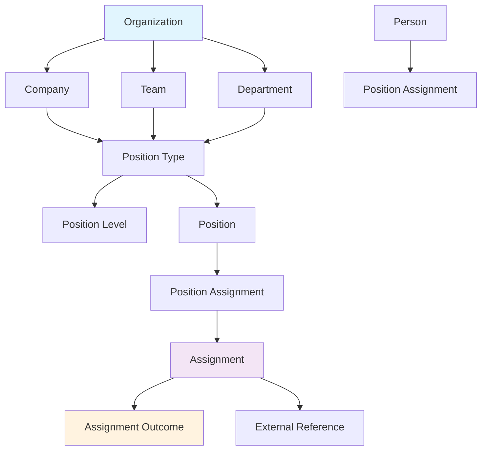
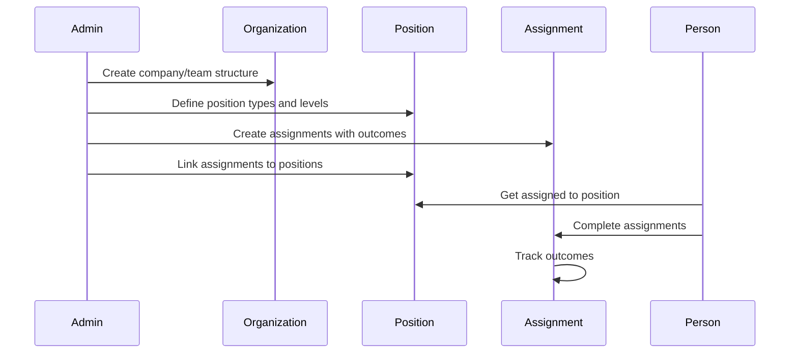

# Align

The Align module focuses on organizational structure, position management, and assignment tracking. It provides the foundation for understanding how work is organized and distributed within organizations.

## Overview

Align helps organizations structure their work by defining positions, roles, and assignments. It creates a clear hierarchy and accountability framework that supports both the Collaborate and Transform modules.

## Core Domain Objects

### Organization Hierarchy
- **Company**: Top-level organization
- **Team**: Sub-organization within a company
- **Department**: Specialized team with specific focus

### Position Management
- **Position Type**: Defines a role (e.g., "Software Engineer", "Product Manager")
- **Position Level**: Seniority level within a position type (e.g., "Junior", "Senior", "Lead")
- **Position**: Specific combination of type and level

### Assignment System
- **Assignment**: A specific task, project, or responsibility
- **Position Assignment**: Links assignments to positions (required or suggested)
- **Assignment Outcome**: Measurable results or sentiment indicators
- **External Reference**: Links to external documentation or resources

## Key Features

### 1. Organizational Structure
- Hierarchical organization management
- Company > Team > Department structure
- Clear ownership and reporting relationships

### 2. Position Definition
- Flexible position type creation
- Multiple seniority levels per position type
- Company-specific position customization

### 3. Assignment Management
- Create and track assignments
- Link assignments to positions
- Define required vs suggested assignments
- Track outcomes and external references

### 4. Position Assignment
- Assign people to positions
- Track assignment history
- Support for temporary and permanent assignments

## Data Flow

## Future Vision

### Short Term
- Enhanced position assignment workflows
- Assignment completion tracking
- Outcome measurement dashboards

### Medium Term
- Skills-based position matching
- Automated assignment recommendations
- Performance analytics integration

### Long Term
- AI-powered position optimization
- Dynamic organizational restructuring
- Predictive assignment success modeling

## Integration Points

### With Collaborate
- Positions inform huddle participant roles
- Organizational structure determines huddle scope
- Assignment completion feeds into huddle discussions

### With Transform
- Assignment outcomes become transformation metrics
- Position changes track career progression
- Organizational restructuring supports transformation initiatives

## Technical Implementation

### Models
- `Organization` (STI: Company, Team, Department)
- `PositionType`
- `PositionLevel`
- `Position`
- `Assignment`
- `AssignmentOutcome`
- `PositionAssignment`
- `ExternalReference`

### Key Controllers
- `OrganizationsController`
- `PositionTypesController`
- `PositionsController`
- `AssignmentsController`

### Decorators
- `OrganizationDecorator`
- `PositionTypeDecorator`
- `PositionDecorator`
- `AssignmentDecorator`

---

*This module provides the structural foundation that enables effective collaboration and transformation within organizations.* 