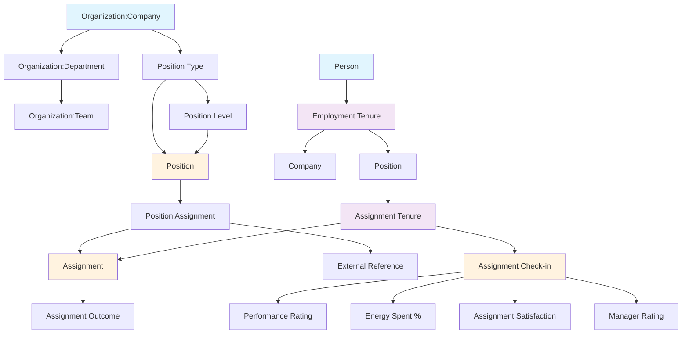
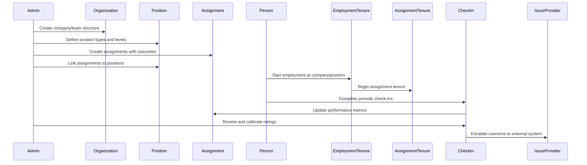

# Align

The Align module focuses on organizational structure, position management, and assignment tracking. It provides the foundation for understanding how work is organized and distributed within organizations.

## Overview

Align helps organizations structure their work by defining positions, roles, and assignments. It creates a clear hierarchy and accountability framework that supports both the Collaborate and Transform modules.

## Core Domain Objects

### Organization Hierarchy
- **Company**: Top-level organization
- **Team**: Sub-organization within a company
- **Department**: Specialized team with specific focus

### Position Management
- **Position Type**: Defines a role (e.g., "Software Engineer", "Product Manager")
- **Position Level**: Seniority level within a position type (e.g., "Junior", "Senior", "Lead")
- **Position**: Specific combination of type and level

### Assignment System
- **Assignment**: A specific task, project, or responsibility
- **Position Assignment**: Links assignments to positions (required or suggested)
- **Assignment Outcome**: Measurable results or sentiment indicators
- **External Reference**: Links to external documentation or resources

### People-to-Assignment Connection (Future Vision)
- **Employment Tenure**: Time-based employment relationship between Person and Company/Position
- **Assignment Tenure**: Time-based assignment relationship between Person and Assignment
- **Assignment Check-in**: Periodic performance and satisfaction reviews
  - Performance Rating: Official assignment rating
  - Energy Spent %: Percentage of energy actually spent on assignment
  - Assignment Satisfaction: Does the assignment holder want this assignment
  - Manager Rating: How the manager rates the assignment holder's performance
- **Issue Provider**: External system integration (e.g., Asana) for escalating assignment concerns

### Person-Company Association Types
The system will support at least 4 ways a person can be associated with a company:
1. **Employment**: Official employment relationship with position, manager, and tenure
2. **Huddle Participation**: Participation in collaborative sessions and meetings
3. **Ability Milestone Attainment**: Certifications, skills, and competency achievements
4. **Observation**: Records of noteworthy actions associated with organizational goals, assignments, or abilities

## Key Features

### 1. Organizational Structure
- Hierarchical organization management
- Company > Team > Department structure
- Clear ownership and reporting relationships

### 2. Position Definition
- Flexible position type creation
- Multiple seniority levels per position type
- Company-specific position customization

### 3. Assignment Management
- Create and track assignments
- Link assignments to positions
- Define required vs suggested assignments
- Track outcomes and external references

### 4. Position Assignment
- Assign people to positions
- Track assignment history
- Support for temporary and permanent assignments

### 5. People-to-Assignment Connection (Planned)
- **Employment Tenure Tracking**: Track when people work for companies in specific positions
- **Assignment Tenure Management**: Track when people work on specific assignments
- **Performance Check-ins**: Regular reviews of assignment performance and satisfaction
- **Cross-Manager Reviews**: Allow sibling managers to review and calibrate ratings
- **Issue Escalation**: Drop issues to external systems (Asana) for assignment concerns
- **Data Migration**: Efficient import of existing employment and assignment data

## Data Flow

## Future Vision

### Short Term
- Enhanced position assignment workflows
- Assignment completion tracking
- Outcome measurement dashboards

### Medium Term
- Skills-based position matching
- Automated assignment recommendations
- Performance analytics integration

### Long Term
- AI-powered position optimization
- Dynamic organizational restructuring
- Predictive assignment success modeling

### People-to-Assignment Connection Roadmap
1. **Employment Tenure Model**: Track when people work for companies in specific positions
2. **Assignment Tenure Model**: Track when people work on specific assignments
3. **Assignment Check-in System**: Periodic performance and satisfaction reviews
4. **Cross-Manager Review System**: Allow calibration of ratings across managers
5. **Issue Provider Integration**: Connect to external systems (Asana) for escalation
6. **Data Migration Tools**: Import existing employment and assignment data

### TODO: Employment Tenure Page Improvements
- **Wizard-like Flow**: 
  - Step 1: Select organization/company
  - Step 2: Filter managers to show only employees of that organization
  - Step 3: Filter positions to show only positions within that organization
- **Dynamic Filtering**: Use JavaScript to update dropdowns based on organization selection
- **Better UX**: Make the form more intuitive and user-friendly

## Integration Points

### With Collaborate
- Positions inform huddle participant roles
- Organizational structure determines huddle scope
- Assignment completion feeds into huddle discussions
- Assignment check-ins inform huddle topics and focus areas

### With Transform
- Assignment outcomes become transformation metrics
- Position changes track career progression
- Organizational restructuring supports transformation initiatives
- Performance check-ins provide transformation insights

## Technical Implementation

### Current Models
- `Organization` (STI: Company, Team, Department)
- `PositionType`
- `PositionLevel`
- `Position`
- `Assignment`
- `AssignmentOutcome`
- `PositionAssignment`
- `ExternalReference`

### Planned Models
- `EmploymentTenure`: Links Person to Company/Position with time spans
  - `person_id`, `company_id`, `position_id`, `manager_id` (optional)
  - `started_at`, `ended_at` (nullable for current employment)
  - Validations: no overlapping active tenures for same person/company, ended_at > started_at
  - Note: Future optimization - consider caching active employment status on Person model for performance
- `AssignmentTenure`: Links Person to Assignment with time spans
  - `person_id`, `assignment_id`, `started_at`, `ended_at`
  - `employment_tenure_id` (cached reference), `manager_id` (cached), `position_id` (cached)
  - `anticipated_energy_percentage` - defines "what the assignment IS"
  - Validations: no overlapping active tenures for same person/assignment, ended_at > started_at
- `AssignmentCheckIn`: Periodic performance and satisfaction reviews
  - `assignment_tenure_id`, `check_in_date`
  - `actual_energy_percentage`, `manager_rating`, `employee_rating`, `official_rating`
  - `manager_private_notes`, `employee_private_notes`, `shared_notes`
  - `employee_personal_alignment` (love, like, neutral, prefer_not, only_if_necessary)
  - Tracks "how it's GOING" vs tenure which defines "what it IS"
- `IssueProvider`: External system integration configuration
- `Issue`: Escalated assignment concerns

### Key Controllers
- `OrganizationsController`
- `PositionTypesController`
- `PositionsController`
- `AssignmentsController`

### Planned Controllers
- `EmploymentTenuresController`
- `AssignmentTenuresController`
- `AssignmentCheckInsController`
- `IssueProvidersController`

### Decorators
- `OrganizationDecorator`
- `PositionTypeDecorator`
- `PositionDecorator`
- `AssignmentDecorator`

### Planned Decorators
- `EmploymentTenureDecorator`
- `AssignmentTenureDecorator`
- `AssignmentCheckInDecorator`

---

## Authorization & Security Implementation

### Current Implementation Status ✅
- **Pundit Integration**: Fully implemented with proper policy objects
- **Employment Tenure Authorization**: Complete with `EmploymentTenurePolicy`
- **Person Authorization**: Complete with `PersonPolicy` 
- **Admin Role**: Implemented via `og_admin` boolean flag on Person model

### Authorization Patterns Used
1. **Policy-Based Authorization**: Each model has a dedicated policy class
2. **Scope-Based Filtering**: `policy_scope` for collection actions
3. **Action-Specific Permissions**: `authorize` for individual record actions
4. **Admin Bypass**: `og_admin` flag bypasses all permission checks

### Key Authorization Rules
- **Employment Tenures**: Users can only manage their own, admins can manage all
- **Person Profiles**: Users can only view/edit their own, admins can view all
- **People Index**: Admin-only access
- **Employment Actions**: Users can change their own employment, admins can change any

### Lessons Learned & Best Practices
1. **Centralize Authorization**: Use Pundit policies instead of inline controller logic
2. **Verify Authorization**: Always use `verify_authorized` and `verify_policy_scoped` callbacks
3. **Test Policies Independently**: Policies should be unit tested separately from controllers
4. **Clear Permission Hierarchy**: Admin role should be simple and bypass all checks
5. **Consistent Patterns**: Use the same authorization approach across all controllers

### Future Authorization Enhancements
- **Organization-Level Permissions**: Discrete permissions per organization (see `docs/vision_for_authorization.md`)
- **Permission Inheritance**: Company → Department → Team permission inheritance
- **Role-Based Access Control**: Expand beyond simple admin flag to role-based system
- **Permission Caching**: Cache permissions for performance optimization

---

## Implementation Notes: Assignment Tenure & Check-in System

### Key Design Decisions Made ✅

#### **Model Structure**
- **AssignmentTenure**: Defines "what the assignment IS" (scope, energy, duration)
- **AssignmentCheckIn**: Tracks "how it's GOING" (performance, alignment, actual energy)
- **Separate models** for clean separation of concerns and historical tracking

#### **Business Logic**
- **Tenure starts immediately** when assignment begins (not waiting for first check-in)
- **Energy changes** can trigger new tenure creation (manager decides threshold)
- **Manager changes** don't affect assignment tenures (only cached in check-ins)
- **Check-ins are immutable** - never update, only create new ones

#### **Data Flow**
- **Anticipated energy %** comes from `PositionAssignment` → copied to `AssignmentTenure`
- **Employment tenure data** looked up dynamically (no caching for now)
- **Check-in defaults** pre-populate from tenure data for first check-in

#### **UI Philosophy**
- **"What the assignment IS"** vs **"How it's GOING"** distinction should be clear
- **Check-in fields** may appear next to tenure creation flow for convenience
- **Energy % changes** should be obvious when they warrant new tenure creation

### Future Enhancements (Logged)
- **Employment tenure caching** using JSONB or naming conventions
- **Assignment scope validation** based on energy % changes
- **Check-in frequency enforcement** (3-month minimum)
- **Historical progression views** for ratings over time

### Phase 4: Advanced Assignment Management & Analytics (Future)

#### **"Your Job Description" Page**
- **Single-page assignment management** for employees to view/edit all their assignments
- **Bulk edit interface** for assignment tenures and check-ins in one view
- **Visual indicators** for energy mismatches (anticipated vs actual)
- **Assignment completion tracking** and progress visualization

#### **Organization Alignment Stats Dashboard**
- **Check-in analytics**: Average frequency, total count per employee
- **Assignment metrics**: Completion rates, average duration, energy utilization
- **Organizational health**: Total positions, employees, assignment coverage
- **Performance insights**: Rating distributions, improvement trends
- **Manager oversight**: Check-in frequency monitoring, overdue alerts

---

*This module provides the structural foundation that enables effective collaboration and transformation within organizations.*

## Implementation Plan: People-to-Assignment Connection

### Phase 1: Foundation Models (Week 1)

#### Commit 1: Employment Tenure Model
- Create `EmploymentTenure` model with:
  - `person_id`, `company_id`, `position_id`, `manager_id` (optional)
  - `started_at`, `ended_at` (nullable for current employment)
  - Validations: no overlapping active tenures for same person/company, ended_at > started_at
  - Validations and associations
- Add basic controller and views for CRUD operations
- Write specs for model and controller

#### Commit 2: Assignment Tenure Model (NEXT)
- Create `AssignmentTenure` model with:
  - `person_id`, `assignment_id`, `started_at`, `ended_at`
  - `employment_tenure_id` (cached reference), `manager_id` (cached), `position_id` (cached)
  - `anticipated_energy_percentage` - defines "what the assignment IS"
  - Validations: no overlapping active tenures for same person/assignment, ended_at > started_at
- Create `AssignmentCheckIn` model with all 9 check-in fields
- Add `anticipated_energy_percentage` to `PositionAssignment` model
- Create controllers and basic views for both models
- Write high-value specs for complex business logic (overlapping tenures, energy changes)

#### Commit 3: Update Existing Models
- Add associations to existing models:
  - `Person` has_many `employment_tenures`, `assignment_tenures`
  - `Company` has_many `employment_tenures`
  - `Position` has_many `employment_tenures`
  - `Assignment` has_many `assignment_tenures`
- Update decorators to show tenure information
- Write specs for new associations

### Phase 2: Check-in System (Week 2)

#### Commit 4: Assignment Check-in Model
- Create `AssignmentCheckIn` model with:
  - `assignment_tenure_id`
  - `check_in_date`
  - `actual_energy_percentage` (integer 0-100)
  - `employee_rating` (enum: working_to_meet, meeting, exceeding)
  - `manager_rating` (enum: working_to_meet, meeting, exceeding)
  - `official_rating` (enum: working_to_meet, meeting, exceeding)
  - `employee_private_notes` (text)
  - `manager_private_notes` (text)
  - `shared_notes` (text)
  - `employee_personal_alignment` (enum: love, like, neutral, prefer_not, only_if_necessary)
- Add validations and associations
- Write specs

#### Commit 5: Check-in Controller and Views
- Create `AssignmentCheckInsController` with CRUD operations
- Build forms for creating/editing check-ins
- Add index view to list all check-ins
- Write controller specs

#### Commit 6: Check-in Integration
- Add check-in functionality to assignment tenure views
- Create dashboard widgets for recent check-ins
- Add notifications for overdue check-ins
- Write integration specs

### Phase 3: Cross-Manager Reviews (Week 3)

#### Commit 7: Review System Model
- Create `AssignmentReview` model for cross-manager reviews:
  - `assignment_check_in_id`
  - `reviewer_id` (person doing the review)
  - `review_date`
  - `rating_agreement` (enum: agree, disagree, needs_discussion)
  - `notes` (text)
- Add validations and associations
- Write specs

#### Commit 8: Review Interface
- Create `AssignmentReviewsController`
- Build review interface for managers
- Add review notifications
- Write controller specs

#### Commit 9: Review Dashboard
- Create dashboard for viewing all reviews
- Add filtering by agreement/disagreement
- Create reports for rating calibration
- Write integration specs

### Phase 4: Issue Provider Integration (Week 4)

#### Commit 10: Issue Provider Model
- Create `