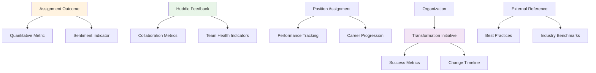
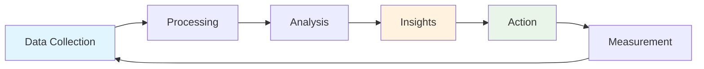
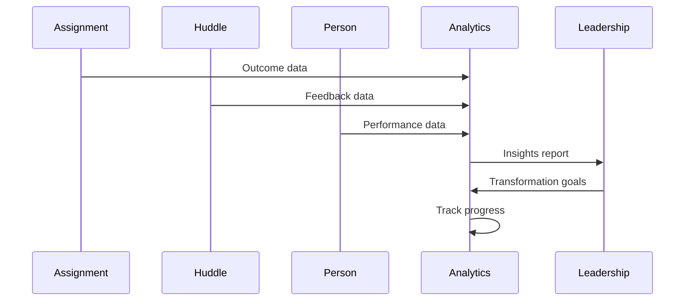
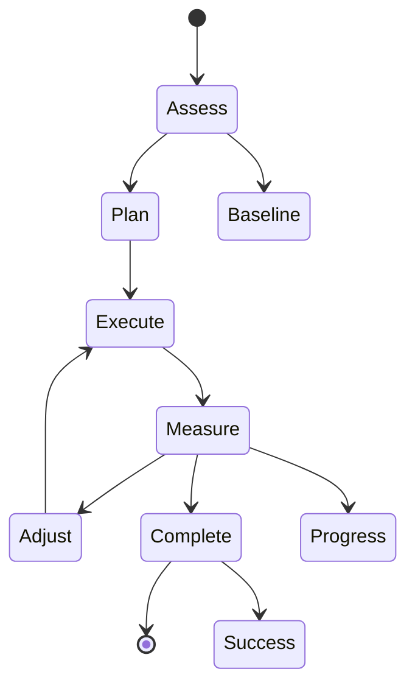

# Transform

The Transform module measures outcomes, tracks progress, and drives organizational change through data-driven insights and continuous improvement processes.

## Overview

Transform provides the measurement and analytics foundation that enables organizations to understand their current state, track progress toward goals, and make data-driven decisions about organizational change. It turns collaboration and alignment data into actionable insights.

## Core Domain Objects

### Measurement System
- **Assignment Outcome**: Measurable results from completed assignments
- **Quantitative Metric**: Numeric performance indicators
- **Sentiment Indicator**: Emotional and qualitative feedback
- **Collaboration Metrics**: Team interaction and effectiveness measures

### Progress Tracking
- **Performance Tracking**: Individual and team performance over time
- **Career Progression**: Position changes and skill development
- **Team Health Indicators**: Overall team effectiveness and satisfaction

### Transformation Framework
- **Transformation Initiative**: Planned organizational changes
- **Success Metrics**: Key performance indicators for change initiatives
- **Change Timeline**: Planned milestones and deadlines
- **Best Practices**: External references and industry benchmarks

## Key Features

### 1. Outcome Measurement
- Track assignment completion and quality
- Measure quantitative and sentiment-based outcomes
- Aggregate metrics across teams and organizations
- Historical trend analysis

### 2. Progress Analytics
- Individual performance tracking
- Team effectiveness measurement
- Career progression monitoring
- Skill development assessment

### 3. Transformation Planning
- Define transformation initiatives
- Set success metrics and timelines
- Track progress against goals
- Identify areas needing attention

### 4. Benchmarking
- Compare against industry standards
- Reference best practices
- Identify improvement opportunities
- Share successful patterns

## Measurement Framework

## Data Flow

## Future Vision

### Short Term
- Enhanced analytics dashboards
- Automated metric calculation
- Real-time progress tracking
- Custom report generation

### Medium Term
- Predictive analytics for transformation success
- AI-powered insights and recommendations
- Automated benchmarking against industry standards
- Advanced visualization and reporting

### Long Term
- Machine learning-driven transformation optimization
- Real-time organizational health monitoring
- Predictive modeling for change initiatives
- Integration with external analytics platforms

## Integration Points

### With Align
- Assignment outcomes become transformation metrics
- Position changes track organizational evolution
- Performance data informs structural decisions

### With Collaborate
- Huddle feedback drives team transformation
- Collaboration patterns inform organizational changes
- Success metrics from huddles guide improvement initiatives

## Technical Implementation

### Models
- `AssignmentOutcome`
- `HuddleFeedback`
- `PositionAssignment`
- `ExternalReference`
- `Notification` (for transformation updates)

### Key Controllers
- `AssignmentsController` (outcome tracking)
- `HuddlesController` (feedback collection)
- `PositionsController` (performance tracking)

### Services
- `AnalyticsService` (future)
- `TransformationService` (future)
- `BenchmarkingService` (future)

### Jobs
- `Transform::CalculateMetricsJob` (future)
- `Transform::GenerateInsightsJob` (future)
- `Transform::UpdateBenchmarksJob` (future)

## Measurement Categories

### Quantitative Metrics
- Assignment completion rates
- Performance scores
- Time-to-completion
- Success rates
- Efficiency indicators

### Sentiment Indicators
- Team satisfaction scores
- Engagement levels
- Stress indicators
- Collaboration quality
- Change readiness

### Collaboration Metrics
- Huddle participation rates
- Feedback quality scores
- Cross-team interaction
- Knowledge sharing
- Innovation indicators

## Transformation Process

## Best Practices

### Measurement
- Define clear, measurable objectives
- Use consistent metrics across the organization
- Regular data collection and analysis
- Transparent reporting and sharing

### Transformation
- Start with small, manageable changes
- Communicate clearly and frequently
- Celebrate successes and learn from failures
- Maintain momentum and engagement

### Analytics
- Focus on actionable insights
- Present data in clear, visual formats
- Regular review and adjustment of metrics
- Balance quantitative and qualitative data

## Success Indicators

### Individual Level
- Assignment completion rates
- Skill development progress
- Career advancement
- Engagement and satisfaction

### Team Level
- Collaboration effectiveness
- Communication quality
- Innovation and creativity
- Conflict resolution

### Organizational Level
- Overall performance improvement
- Change adoption rates
- Employee retention
- Competitive positioning

---

*This module provides the measurement and analytics foundation that enables data-driven transformation and continuous organizational improvement.* 