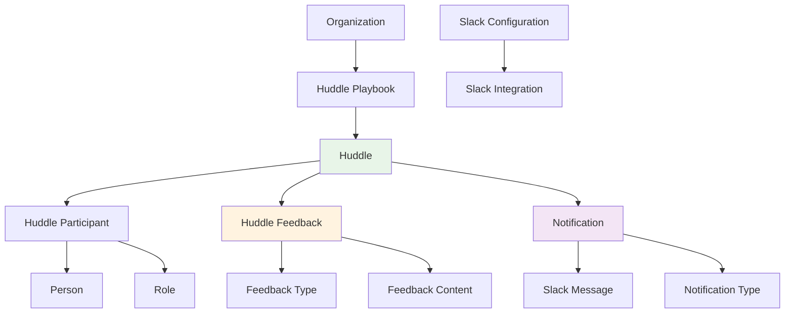
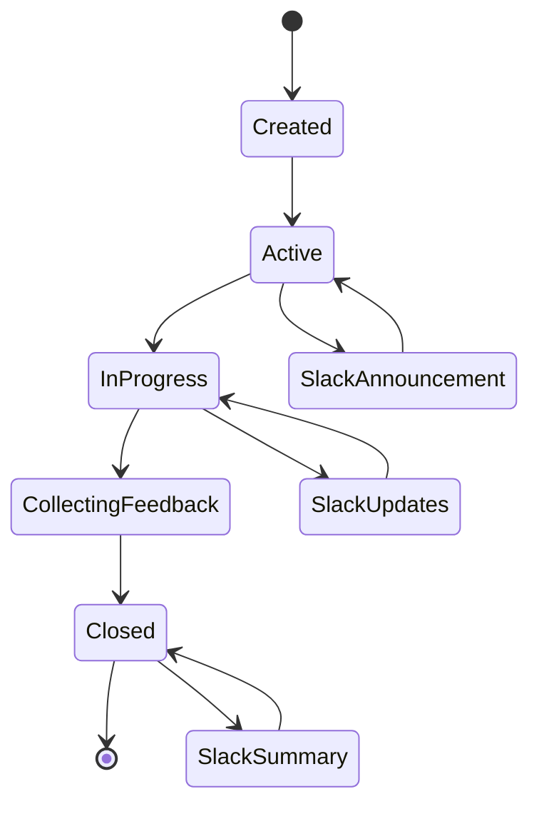
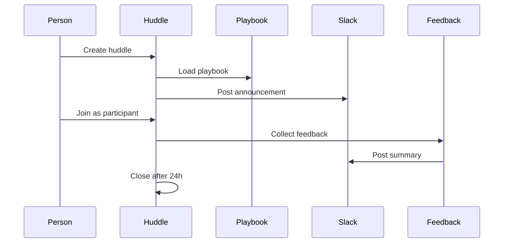
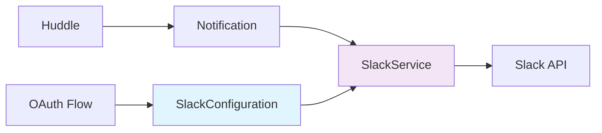

# Collaborate

The Collaborate module enables effective team collaboration through structured huddles, feedback collection, and Slack integration. It creates spaces for meaningful conversations and continuous improvement.

## Overview

Collaborate provides the tools and processes for teams to come together, share insights, and work towards common goals. It transforms ad-hoc meetings into structured, productive sessions that drive team alignment and growth.

## Core Domain Objects

### Huddle System
- **Huddle Playbook**: Template for structured huddles with predefined agendas
- **Huddle**: A specific collaborative session with participants and feedback
- **Huddle Participant**: Person participating in a huddle with a specific role
- **Huddle Feedback**: Individual feedback collected during or after huddles

### Feedback & Communication
- **Notification**: System for communicating huddle updates via Slack
- **Slack Configuration**: Organization-specific Slack integration settings
- **Slack Integration**: Automated posting of announcements and summaries

### Participant Roles
- **Facilitator**: Guides the huddle discussion
- **Active Participant**: Engaged in the conversation
- **Observer**: Watches and learns
- **Note Taker**: Records key points
- **Time Keeper**: Manages time constraints

## Key Features

### 1. Huddle Management
- Create structured huddles with playbooks
- Assign participants with specific roles
- Track huddle lifecycle (active/closed)
- 24-hour expiration for focused discussions

### 2. Feedback Collection
- Real-time feedback during huddles
- Post-huddle reflection and insights
- Anonymous feedback options
- Sentiment and quantitative feedback types

### 3. Slack Integration
- Automated huddle announcements
- Post-huddle summaries
- Channel-specific messaging
- OAuth-based authentication

### 4. Playbook System
- Predefined huddle structures
- Special session types (retrospectives, planning, etc.)
- Organization-specific customization
- Channel mapping for Slack integration

## Huddle Lifecycle

## Data Flow

## Future Vision

### Short Term
- Enhanced feedback analytics
- Multi-language support
- Mobile-optimized huddle experience
- Integration with calendar systems

### Medium Term
- AI-powered huddle facilitation
- Automated action item tracking
- Sentiment analysis of feedback
- Predictive huddle success modeling

### Long Term
- Virtual reality huddle spaces
- Real-time translation services
- Advanced analytics and insights
- Integration with external collaboration tools

## Integration Points

### With Align
- Huddle participants based on organizational structure
- Position-based role assignments
- Assignment completion discussions in huddles

### With Transform
- Feedback data drives transformation metrics
- Huddle insights inform organizational changes
- Success patterns from huddles guide transformation initiatives

## Technical Implementation

### Models
- `Huddle`
- `HuddlePlaybook`
- `HuddleParticipant`
- `HuddleFeedback`
- `Notification`
- `SlackConfiguration`

### Key Controllers
- `HuddlesController`
- `Organizations::HuddlePlaybooksController`
- `Organizations::SlackController`

### Jobs
- `Huddles::PostAnnouncementJob`
- `Huddles::PostSummaryJob`
- `Huddles::PostFeedbackJob`

### Services
- `SlackService`

### Decorators
- `HuddleDecorator`
- `Organizations::HuddleInstructionDecorator`

## Slack Integration Architecture

## Feedback Types

### Quantitative
- Numeric ratings and scores
- Performance metrics
- Satisfaction surveys

### Sentiment
- Text-based feedback
- Emotional responses
- Qualitative insights

## Best Practices

### Huddle Facilitation
- Set clear objectives before starting
- Assign roles based on participant strengths
- Keep discussions focused and time-bound
- Encourage equal participation

### Feedback Collection
- Collect feedback during and after huddles
- Provide both anonymous and attributed options
- Use feedback to improve future huddles
- Share insights with participants

### Slack Integration
- Configure appropriate channels for different huddle types
- Use consistent messaging formats
- Include relevant context in announcements
- Respect notification preferences

---

*This module creates the collaborative foundation that enables teams to work together effectively and continuously improve their processes.* 